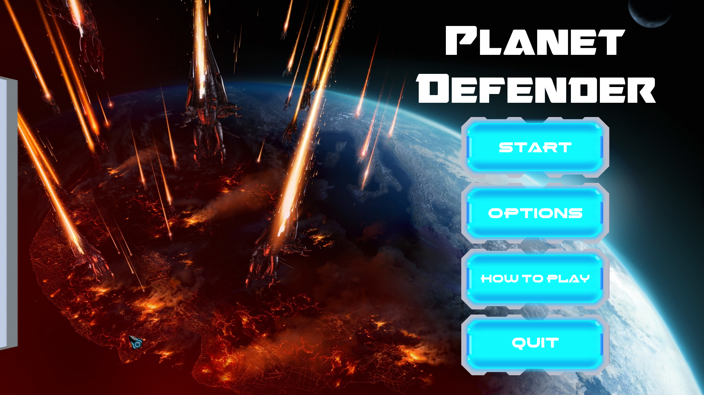
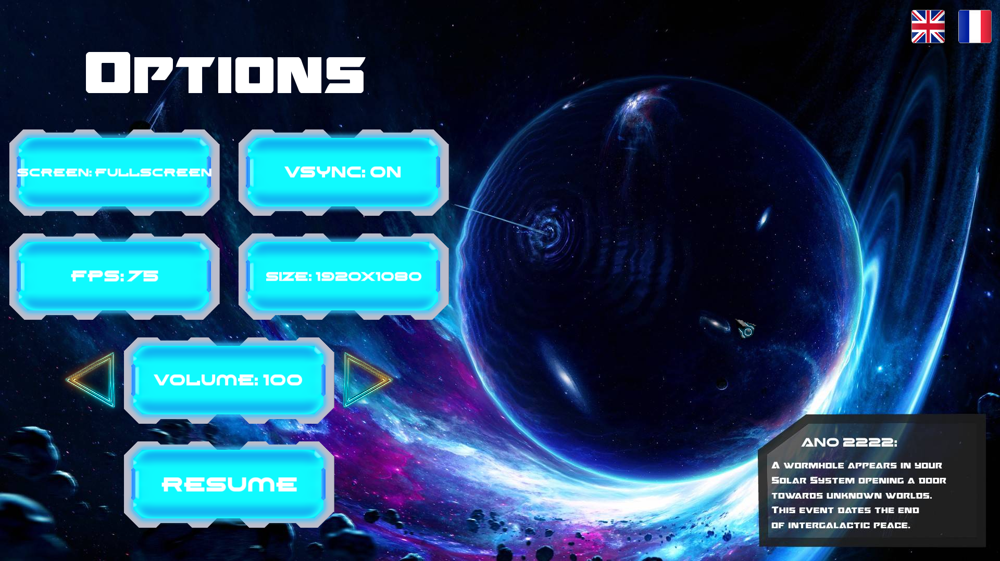
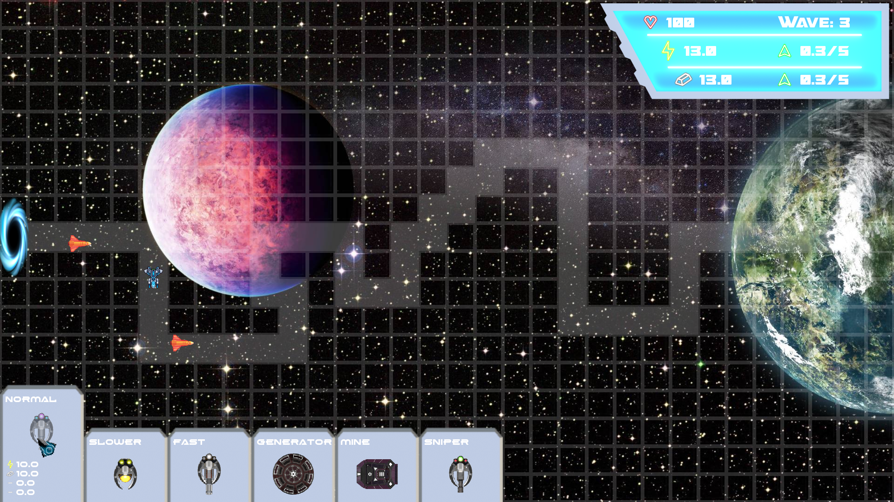
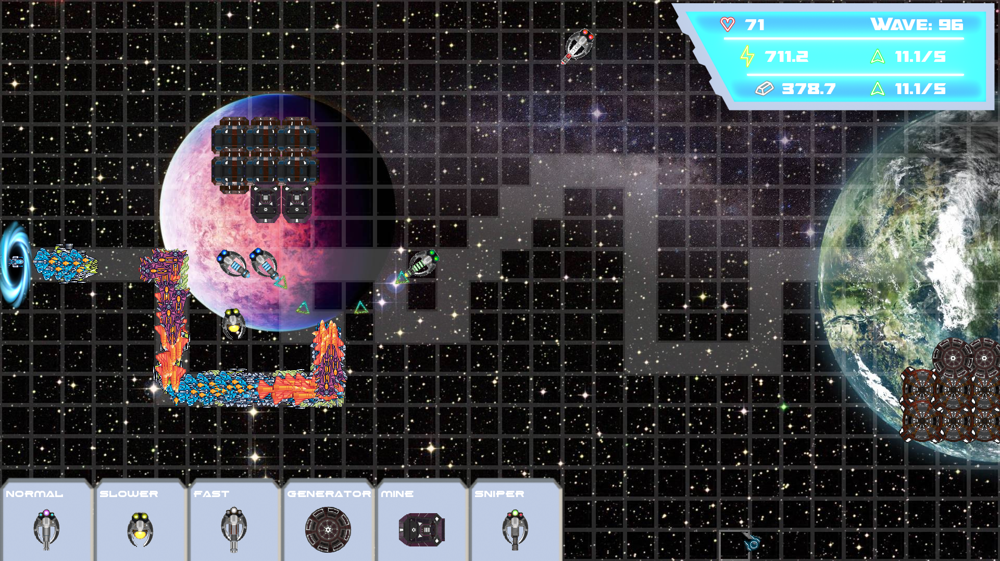

# my_defender

This is the first video game project realized at Epitech during our first year,
The development lasted a month and was carried out by two people.
It's a furturistic tower defense game developped in C with Sfml C bindings.

This project has recieved the best grade in the year 2022 at Paris.

The usage of C and the clean memory management use allows the usage of very very large amounts of projectile and enemies at once on the screen. The turrets balance is not very well designed.






## Quick setup

/!\ CSFML is requierd to run the project

```
make
./my_defender
```

## Authors

- [Arthur Aillet](https://github.com/Arthur-Aillet)
- [Axel Denis](https://github.com/axel-denis)

## License

This software uses the license [MIT](LICENSE.md)
